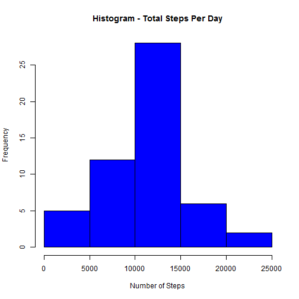
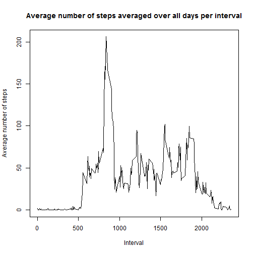
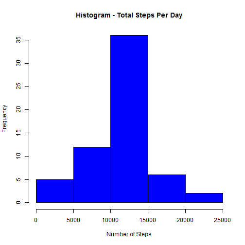
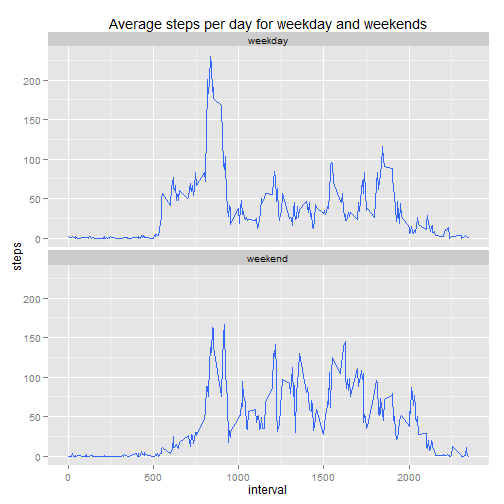

# "Reproducible Research - Peer Assessment 1"
***

### Loading and preprocessing Data

Below we will first download the zip file from the location specified in the assignment question and then extract the data


```r
# here we assume that the zip file has been previously downloaded and named as "Activity Monitoring Data.zip"

file <- "Activity Monitoring Data.zip"

# save the file meta data without unzipping the file
filename <- unzip(file, list = TRUE)

# Unzip the file in working directory
unzip(file)
```

We will now create read the data from the file into a variable called as amdRaw which has all the records from the file. We will also create a new dataframe variable called amdPD which will have only values that dont have NA in the steps column


```r
# use the file name from the file meta data extracted before to read the raw data into
# a data frame 
amdRaw <- read.csv(filename$Name, header = TRUE, na.strings = "NA", colClasses = c("numeric", "character", "numeric"))

head(amdRaw)
```

```
##   steps       date interval
## 1    NA 2012-10-01        0
## 2    NA 2012-10-01        5
## 3    NA 2012-10-01       10
## 4    NA 2012-10-01       15
## 5    NA 2012-10-01       20
## 6    NA 2012-10-01       25
```

```r
# check the number of rows that have valid step values i.e. no NA values
nrow(amdRaw[!is.na(amdRaw$steps),])
```

```
## [1] 15264
```

```r
# raw data without NA values
amdPD <- amdRaw[!is.na(amdRaw$steps),]
```

***

### What is mean total number of steps taken per day?

Make a histogram of the total number of steps taken each day


```r
amdStepsPerDay <- aggregate(steps ~ date ,amdPD, sum)

hist(amdStepsPerDay$steps, col = "blue", main = "Histogram - Total Steps Per Day", xlab = "Number of Steps")
```

 

Calculate and report the mean and median total number of steps taken per day
Mean is

```r
mean(amdStepsPerDay$steps)
```

```
## [1] 10766.19
```
Median is 


```r
median(amdStepsPerDay$steps)
```

```
## [1] 10765
```
***

### What is the average daily activity pattern?

Make a time series plot (i.e. type = "l") of the 5-minute interval (x-axis) and the average number of steps taken, averaged across all days (y-axis)


```r
# aggregate the steps for each interval and take their average.
amdAvgStepsPerInterval <- aggregate(steps ~ interval, amdPD, mean)

# generate a time series plot for the interval
plot(amdAvgStepsPerInterval$interval, amdAvgStepsPerInterval$steps, type='l', col=1, 
     main="Average number of steps averaged over all days per interval", xlab="Interval", 
     ylab="Average number of steps")
```

 

From the above chart we can see that the number of steps increases to a high value of around 200 steps somewhere in between intervals of 500-1000 and from that time onwards remains relatively stable in a band of 25 to 100 steps

Which 5-minute interval, on average across all the days in the dataset, contains the maximum number of steps?


```r
maxAvgStepsPerInterval <- max(amdAvgStepsPerInterval$steps)

# Interval with max number of avg steps is as below
amdAvgStepsPerInterval[amdAvgStepsPerInterval$steps== maxAvgStepsPerInterval, ]
```

```
##     interval    steps
## 104      835 206.1698
```

From above results, we can see that the interval 835 has the max number of average steps. Max average steps for interval 805 is 206.17

***

### Imputing missing values
Note that there are a number of days/intervals where there are missing values (coded as NA). The presence of missing days may introduce bias into some calculations or summaries of the data.

Calculate and report the total number of missing values in the dataset (i.e. the total number of rows with NAs)


```r
# Number of rows with NA values as below
nrow(amdRaw[is.na(amdRaw$steps),])
```

```
## [1] 2304
```

Total NA values is 2304

Devise a strategy for filling in all of the missing values in the dataset. The strategy does not need to be sophisticated. For example, you could use the mean/median for that day, or the mean for that 5-minute interval, etc.

The strategy that I will use, is to replace the missing values by the average steps per interval across all days.

Create a new dataset that is equal to the original dataset but with the missing data filled in.

Here we will use the startegy of using the mean/average of each interval to fill the missing value for each interval


```r
amdAllValues <- amdRaw

for(i in 1:nrow(amdAllValues)){
    if(is.na(amdAllValues$steps[i])) {
        interval <- amdAllValues$interval[i];
        intervalAvgSteps <- amdAvgStepsPerInterval[amdAvgStepsPerInterval$interval == interval, 2]
        amdAllValues$steps[i] <- intervalAvgSteps
    }
}
```

Make a histogram of the total number of steps taken each day and Calculate and report the mean and median total number of steps taken per day. Do these values differ from the estimates from the first part of the assignment? What is the impact of imputing missing data on the estimates of the total daily number of steps?


```r
# total number of steps taken each day for the new data set with NA values replaced.
amdStepsPerDay <- aggregate(steps ~ date, amdAllValues, sum)

hist(amdStepsPerDay$steps, col = "blue", main = "Histogram - Total Steps Per Day", xlab = "Number of Steps")
```

 

```r
# Mean is
mean(amdStepsPerDay$steps)
```

```
## [1] 10766.19
```

```r
# Median is 
median(amdStepsPerDay$steps)
```

```
## [1] 10766.19
```

After imputing the missing values, the mean remains the same while there is a small difference in the median

***

### Are there differences in activity patterns between weekdays and weekends?

For this part the weekdays() function may be of some help here. Use the dataset with the filled-in missing values for this part.

Create a new factor variable in the dataset with two levels - "weekday" and "weekend" indicating whether a given date is a weekday or weekend day.

Make a panel plot containing a time series plot (i.e. type = "l") of the 5-minute interval (x-axis) and the average number of steps taken, averaged across all weekday days or weekend days (y-axis). See the README file in the GitHub repository to see an example of what this plot should look like using simulated data.


```r
# We change the datatype of the date column to posix date
amdAllValues$day <- weekdays(as.Date(amdAllValues$date))

# then we add a new column called dayType in which we store if the date is a weekend or weekday
amdAllValues$dayType <- ifelse(amdAllValues$day %in%  c("Saturday", "Sunday"),'weekend','weekday')

head(amdAllValues)
```

```
##       steps       date interval    day dayType
## 1 1.7169811 2012-10-01        0 Monday weekday
## 2 0.3396226 2012-10-01        5 Monday weekday
## 3 0.1320755 2012-10-01       10 Monday weekday
## 4 0.1509434 2012-10-01       15 Monday weekday
## 5 0.0754717 2012-10-01       20 Monday weekday
## 6 2.0943396 2012-10-01       25 Monday weekday
```

```r
library(ggplot2)

# we then plot the data for weekday and weekend steps 
qplot(x=interval, y=steps,data=subset(amdAllValues, complete.cases(amdAllValues)),geom='smooth', stat='summary', fun.y=mean) + 
    facet_grid(dayType~.) + facet_wrap(~dayType, nrow=2) + labs(title='Average steps per day for weekday and weekends')
```

 

Looking at the above chart, we can clearly see a difference between the weekday and weekend activities. During the weekday there is a high spike of activity during early intervals but during a weekend the is a consistent activities for intervals 
between 500 to 2000.
